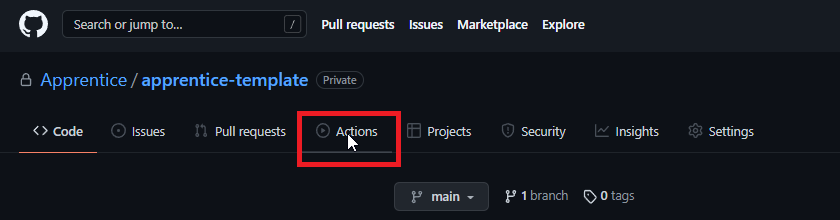
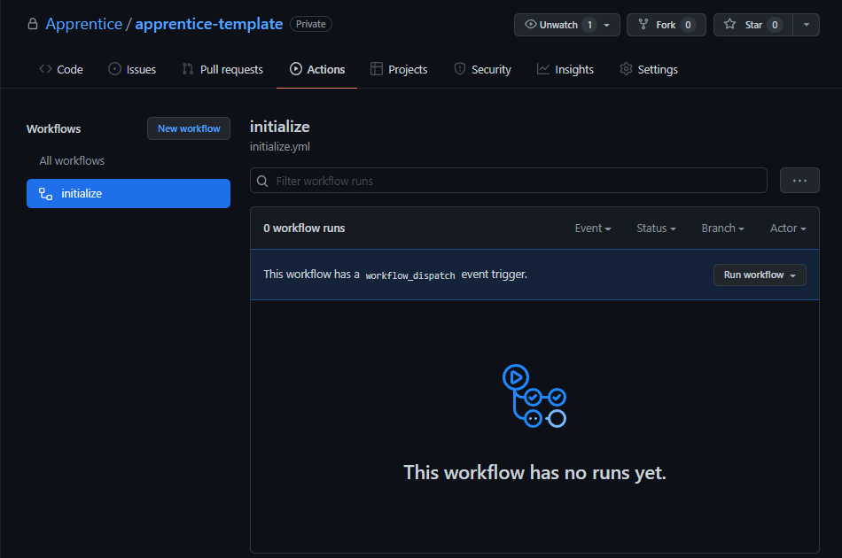
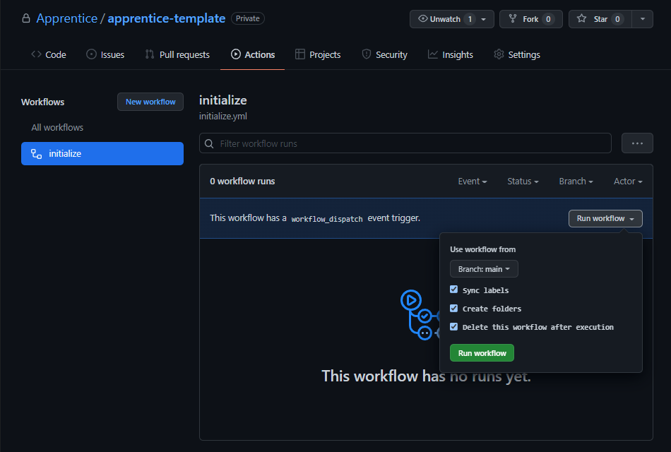
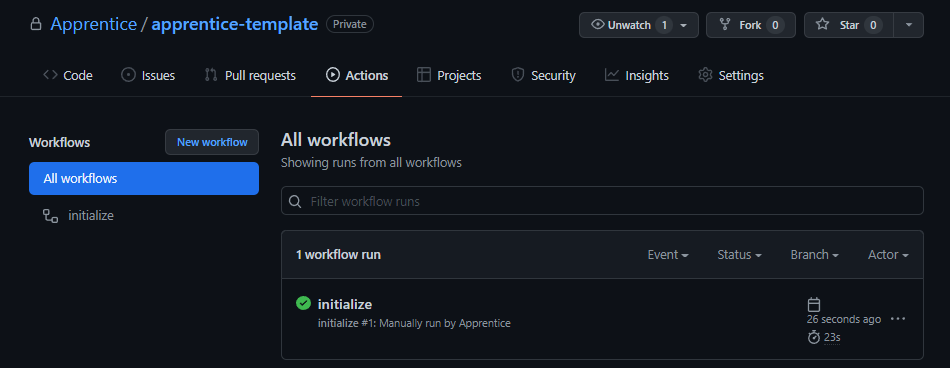
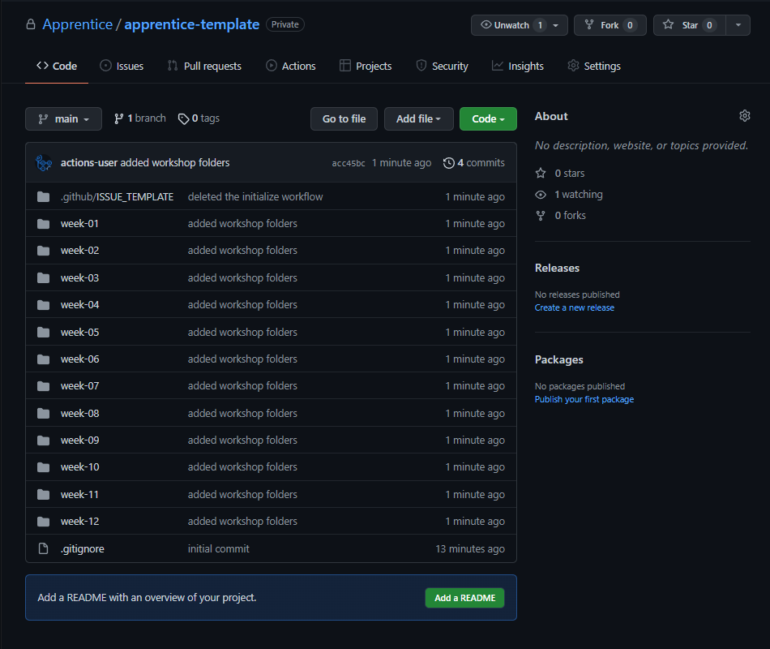
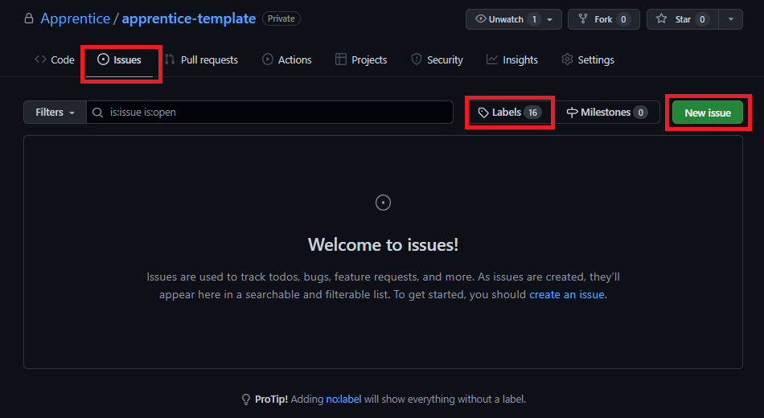
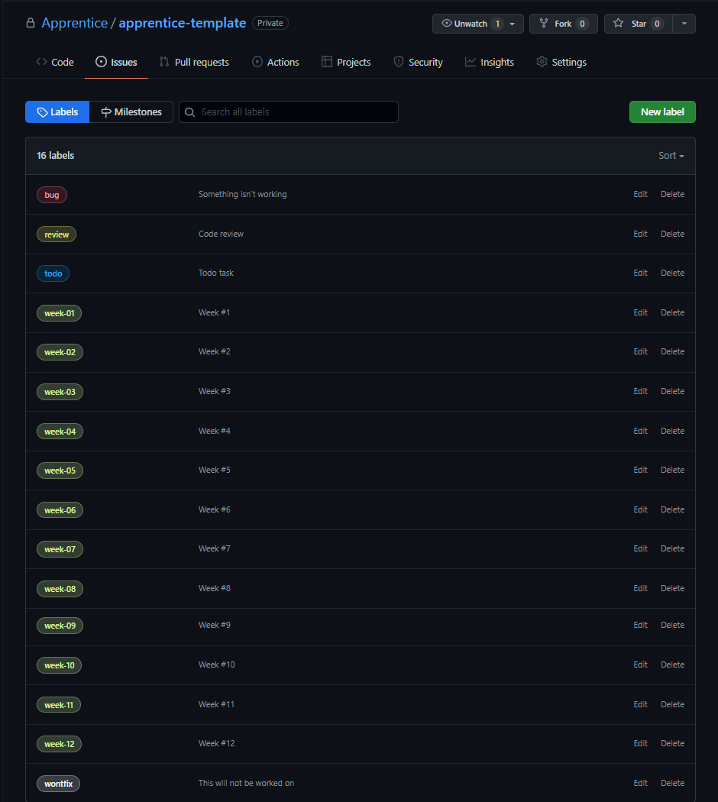
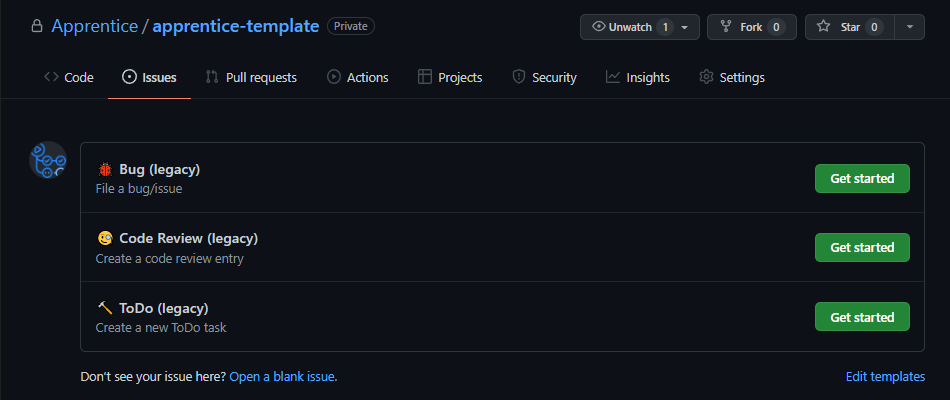

# Initialize your repository

To initialize your repository click on the "Actions" menu item

Select the "initialize" action 

and execute the workflow

The Workflow will do the following tasks:
- create your repository folder structure
- create the appropriate issue labels
- delete this README.md and its assets (screenshots)

When you click on the "Action" menu item again, you should see the workflow executed correctly (indicated by the green checkmark icon)

When you click on the "Code" menu item, you should see folders for weeks 01 through 12 created in your repository (each should have day-1 through day-5 as subfolders)

Next, in the "Issues" section

you should see the following labels and new issue templates:

#### Labels

#### Issue templates

